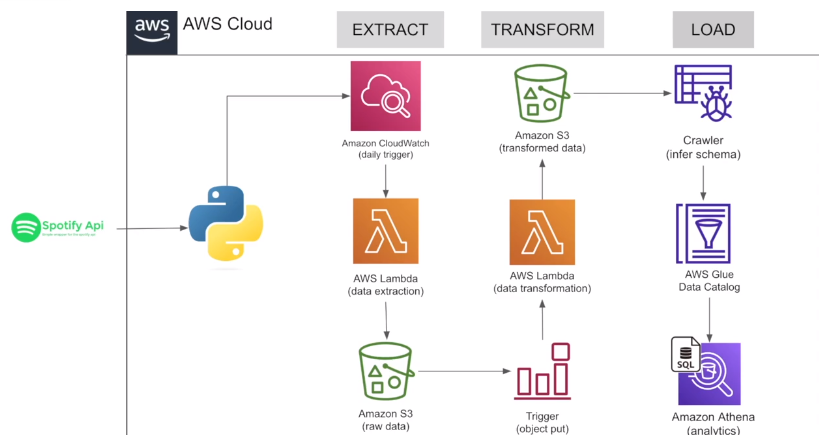

# Spotify-data-engineering-project
Introduction.
In this project, we will build an ETL(Extract,Transform,Load) pipeline using the spotify API on AWS. The pipeline retrieve the data from Spotify API, tranform it to a desired format and load it into AWs data store.

## Architecture

